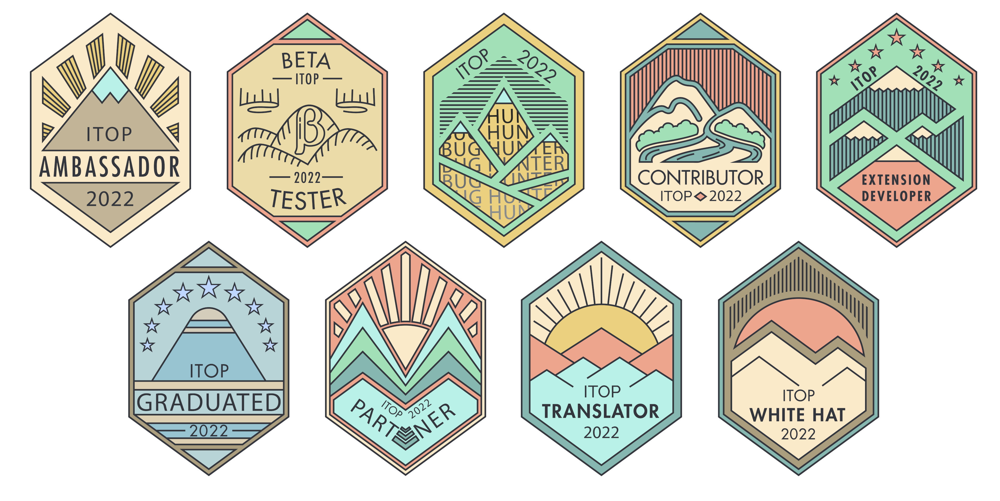

# Contributing to iTop

You want to contribute to iTop? Many thanks to you! 🎉 👍

Here are some guidelines that will help us integrate your work!

## Contributions

### Subjects
You are welcome to create pull requests on any of those subjects:

* 🐛 bug fix
* 🌐 translation / i18n / l10n

If you want to implement a **new feature**, please [create a corresponding ticket](https://sourceforge.net/p/itop/tickets/new/) for review.   
If you ever want to begin implementation, do so in a fork, and add a link to the corresponding commits in the ticket.

For all **security related subjects**, please see our [security policy](SECURITY.md).

All **datamodel modification** should be done in an extension. Beware that such change would 
impact all existing customers, and could prevent them from 
upgrading!
Combodo has a long experience of datamodel changes: they are very disruptive! 
This is why we avoid them in iTop core, especially the changes on existing objects/fields.   
If you have an idea you're sure would benefit to all of iTop users, you may 
[create a corresponding ticket](https://sourceforge.net/p/itop/tickets/new/) to submit it, but be warned that there are lots of good 
reasons to refuse such changes.

### 📄 License
iTop is distributed under the AGPL-3.0 license (see the [license.txt] file),
your code must comply with this license.

If you want to use another license, you may [create an extension][wiki new ext].

[license.txt]: https://github.com/Combodo/iTop/blob/develop/license.txt
[wiki new ext]: https://www.itophub.io/wiki/page?id=latest%3Acustomization%3Astart#by_writing_your_own_extension

## 🔀 iTop branch model

When we first start with Git, we were using the [GitFlow](https://nvie.com/posts/a-successful-git-branching-model/) branch model. As
 there was some confusions about branches to use for current developed release and previous maintained release, and also because we were
 using just a very few of the GitFlow commands, we decided to add just a little modification to this branch model : since april 2020
  we don't have a `master` branch anymore.

Here are the branches we use and their meaning : 

- `develop`: ongoing development version
- `release/*`: if present, that means we are working on a alpha/beta/rc version for shipping
- `support/*`: maintenance branches for older versions

For example, if no version is currently prepared for shipping we could have:

- `develop` containing future 3.1.0 version
- `support/3.0`: 3.0.x maintenance version
- `support/2.7`: 2.7.x maintenance version
- `support/2.6`: 2.6.x maintenance version

In this example, when 3.1.0-beta is shipped that will become:

- `develop`: future 3.2.0 version
- `release/3.1.0`: 3.1.0-beta
- `support/3.0`: 3.0.x maintenance version
- `support/2.7`: 2.7.x maintenance version
- `support/2.6`: 2.6.x maintenance version

And when 3.1.0 final will be out:

- `develop`: future 3.2.0 version
- `support/3.1`: 3.1.x maintenance version (will host developments for 3.1.1)
- `support/3.0`: 3.0.x maintenance version
- `support/2.7`: 2.7.x maintenance version
- `support/2.6`: 2.6.x maintenance version

Also note that we have a "micro-version" concept : each of those versions have a very small amount of modifications. They are made from
 `support/*` branches as well. For example 2.6.2-1 and 2.6.2-2 were made from the `support/2.6.2` branch. 

## Coding

### 🌐 Translations

A [dedicated page](https://www.itophub.io/wiki/page?id=latest%3Acustomization%3Atranslation) is available in the official wiki.

### Where to start ?

1. Create a fork from our repository (see [Working with forks - GitHub Help](https://help.github.com/en/github/collaborating-with-issues-and-pull-requests/working-with-forks))
2. Create a branch in this fork, based on the develop branch
3. Code !

Do create a dedicated branch for each modification you want to propose : if you don't it will be very hard to merge back your work !

Most of the time you should based your developments on the develop branch.    
That may be different if you want to fix a bug, please use develop anyway and ask in your PR if rebase is possible.

### 🎨 PHP styleguide

Please follow [our guidelines](https://www.itophub.io/wiki/page?id=latest%3Acustomization%3Acoding_standards).

### ✅ Tests

Please create tests that covers as much as possible the code you're submitting.

Our tests are located in the `test/` directory, containing a PHPUnit config file : `phpunit.xml.dist`.

### Git Commit Messages

* Describe the functional change instead of the technical modifications
* Use the present tense ("Add feature" not "Added feature")
* Use the imperative mood ("Move cursor to..." not "Moves cursor to...")
* Limit the first line to 72 characters or less
* Please start the commit message with an applicable emoji code (following the [Gitmoji guide](https://gitmoji.carloscuesta.me/)).  
 Beware to use the code (for example `:bug:`) and not the character (🐛) as Unicode support in git clients is very poor for now...  
 Emoji examples :
    * 🌐 `:globe_with_meridians:` for translations
    * 🎨 `:art:` when improving the format/structure of the code
    * ⚡️ `:zap:` when improving performance
    * 🐛 `:bug:` when fixing a bug
    * 🔥 `:fire:` when removing code or files
    * 💚 `:green_heart:` when fixing the CI build
    * ✅ `:white_check_mark:` when adding tests
    * 🔒 `:lock:` when dealing with security
    * ⬆️ `:arrow_up:` when upgrading dependencies
    * ⬇️ `:arrow_down:` when downgrading dependencies
    * ♻️ `:recycle:` code refactoring
    * 💄 `:lipstick:` Updating the UI and style files.

## 👥 Pull request

When your code is working, please:

* stash as much as possible your commits,
* rebase your branch on our repo last commit,
* create a pull request
* mind to check the "[Allow edits from maintainers](https://docs.github.com/en/github-ae@latest/pull-requests/collaborating-with-pull-requests/working-with-forks/allowing-changes-to-a-pull-request-branch-created-from-a-fork)" option !

Detailed procedure to work on fork and create PR is available [in GitHub help pages](https://help.github.com/articles/creating-a-pull-request-from-a-fork/).

### 🙏 We are thankful

We are thankful for all your contributions to the iTop universe! As a thank you gift, we will send stickers to every iTop (& extensions) contributors! 

Stickers' design might change from one year to another. For the first year we wanted to try a "craft beer label" look, see examples below: 

* Bug hunter: Fix a bug
* Translator: Add/update translations
* White hat: Find and/or fix a vulnerability
* Contributor: Contribute by finding a bug, making an extension or any other way
* Partner: For Combodo's official partners
* Graduated: Follow a Combodo's iTop training
* Ambassador: Outstanding community contributors
* Beta tester: Test and give feedback on beta releases
* Extension developer: Develop and publish an extension

